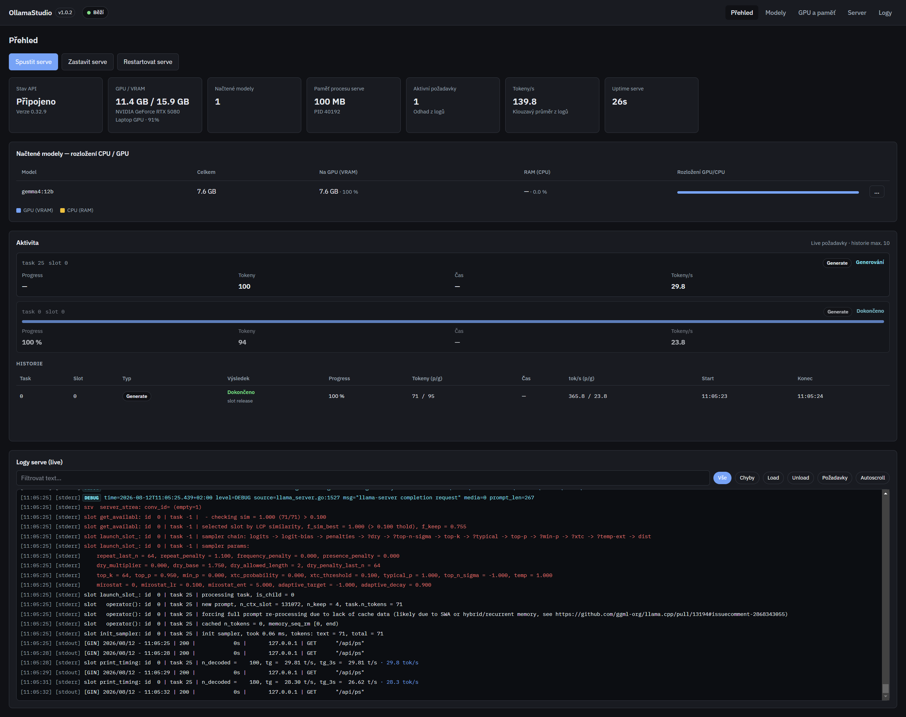
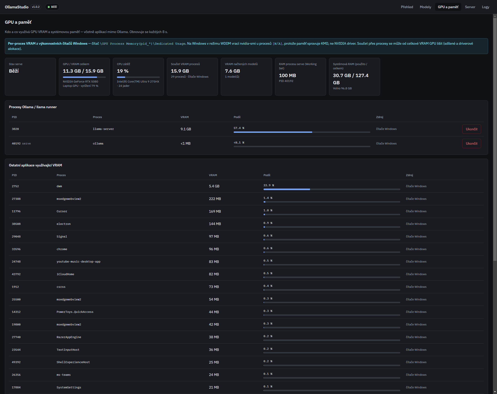

<div align="center">


# OllamaStudio

Desktop app for **Windows** and **Linux** (including WSL) that manages a local
**Ollama** server and, on Windows, an optional **TabbyAPI** backend for **EXL3** models.
OllamaStudio launches the active backend as its own child process, monitors metrics (GPU/CPU/RAM),
manages models and shows live logs.

</div>



## Requirements

- **Node.js** 18+ and npm (on WSL/Linux prefer the Linux Node binary, e.g. `/usr/bin/node`)
- **Ollama CLI installed** ([ollama.com](https://ollama.com)) — the app does not bundle the CLI
- For GPU metrics: an NVIDIA GPU and `nvidia-smi` in PATH (per-process VRAM via Windows performance counters is Windows-only; Linux uses nvidia-smi process list when available)
- **TabbyAPI (optional, Windows):** a separate checkout + Python 3.12 venv (e.g. under `D:\AI\Tabby`). Studio does **not** run `start.bat`; it spawns `venv\Scripts\python.exe main.py` with the install directory as cwd. Keep this venv separate from other tools (e.g. Unsloth).

## Backends

Only **one** managed backend is active at a time. Switching stops the Studio-owned process of the previous backend; an external process already listening on the Tabby port is detected but not killed.

| Backend | Default endpoint | Models |
|---------|------------------|--------|
| Ollama (default) | `127.0.0.1:11434` | Ollama library tags |
| TabbyAPI | `127.0.0.1:5000` | EXL3 folders / HF download |

Tabby auth keys live in `api_tokens.yml` on disk; the UI only shows whether an API/admin key is present. OpenCode gets the **API** key only (never the admin key or a HF token). Continue remains Ollama-only in 1.4.0.

**Known limitation:** Tabby log telemetry is best-effort. When request metrics are missing or unstable, the dashboard shows them as unavailable instead of inventing values. Tabby `/v1/download` itself does not report progress; Studio derives truthful progress from Hugging Face metadata and downloaded bytes on disk, and falls back to an indeterminate status when the total size cannot be determined.

## Important — port 11434

OllamaStudio **hosts** the server itself. Nothing else must hold port **11434**.

### Windows

1. Click the Ollama icon in the system tray → **Quit**
2. Disable Ollama in **Startup apps** (Windows Settings → Apps → Startup)
3. Only then start OllamaStudio

### Linux / WSL

```bash
sudo systemctl stop ollama
sudo systemctl disable ollama   # optional — prevent autostart
```

On a port conflict the app shows a message and offers to terminate the conflicting processes.

## Reusing Windows models in WSL

Set **OLLAMA_MODELS** to the Windows model directory (or leave it empty and let the app auto-detect
`/mnt/*/Users/*/.ollama/models`):

```bash
export OLLAMA_MODELS=/mnt/c/Users/<You>/.ollama/models
```

In the app: **Server** → `OLLAMA_MODELS`. Empty means Ollama’s default (`~/.ollama/models`), except on
Linux/WSL where a Windows `.ollama/models` under `/mnt` is used as a fallback when found.

Reading blobs from `/mnt/c` works but is slower than a native Linux disk.

## Screenshots

### Dashboard

Serve metrics, GPU/VRAM, active requests and history parsed from logs.


### GPU & memory

Per-process VRAM (Windows counters / nvidia-smi), CPU, model CPU/GPU split and killing of Ollama processes.



> Refresh the screenshots with: `npm run build` and then `node ./scripts/capture-screenshots.mjs`.
> The script starts the app in a maximized window and sends a chat request to `ollama serve`
> (picking the smallest installed model), so the shots show live activity, history and a
> loaded model. Requires at least one downloaded model.

## Running

### Development

```bash
npm install
npm run dev
```

On WSL, if the project lives on a Windows mount (`/mnt/…`), prefer a copy on the native Linux
filesystem (e.g. `~/OllamaStudio`) for `npm install` / Electron — `node_modules` and file watching
are much more reliable there.

### Build / installer

```bash
npm run build      # compiles main/preload/renderer
npm run pack       # unpacked app (platform-dependent)
npm run dist       # installer via electron-builder (currently NSIS for Windows)
```

Output: the `release/` folder.

`npm run dist` produces an **unsigned** Windows installer — `package.json` sets
`win.signAndEditExecutable: false` so the build does not require symlink permissions for winCodeSign.

After `pack` on Windows:

```text
release\win-unpacked\OllamaStudio.exe
```

## App pages

| Page | Description |
|------|-------------|
| **Dashboard** | API status, GPU/VRAM, loaded models, activity + request history, live logs |
| **Models** | Pull / load / unload / delete / clone, Continue config (add / update / remove) |
| **GPU & memory** | Per-process VRAM, CPU, system RAM, kill Ollama/runner processes |
| **Server** | OLLAMA_* env (incl. `OLLAMA_MODELS`) + presets (stored in app config, not system env) |
| **Logs** | Live stdout/stderr from `ollama serve` |

## System tray

- Closing the window hides it to the tray (the app keeps running)
- Menu: Show · Start/Stop serve · Restart · Quit (also stops serve)
- Single-instance — launching a second time opens the existing window

## Configuration

Electron **userData** paths:

| Platform | Path |
|----------|------|
| Windows | `%APPDATA%/ollamastudio/` |
| Linux | `~/.config/ollamastudio/` |

- Config: `config.json`
- Load/serve presets: `presets/`
- Serve logs: `logs/ollama-serve.log`

The Continue integration reads/writes `~/.continue/config.yaml` (on Windows:
`%USERPROFILE%\.continue\config.yaml`).

## Changelog & versions

Version changes live in [CHANGELOG.md](CHANGELOG.md). For every release always bump `version`
in `package.json` and add release notes (see the Cursor rule in `.cursor/rules/`).

Then push a git tag `vX.Y.Z` (matching `package.json`). GitHub Actions builds the Windows NSIS
installer, Linux AppImage and `.deb` package and attaches them to the GitHub Release.

The current version is shown in the window title (`OllamaStudio X.Y.Z`) and as a badge in the UI header.

## License

MIT
